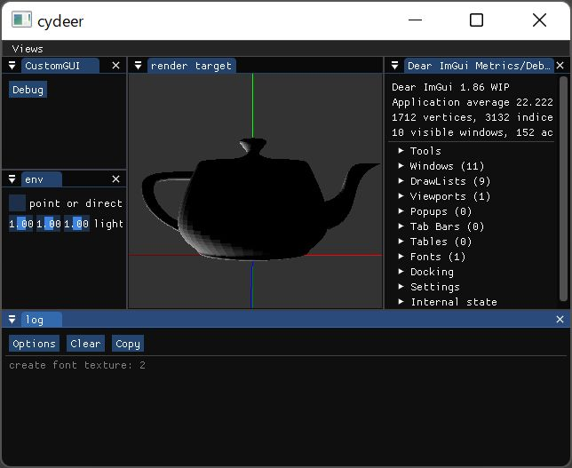

# glglue

The glue code which mediates between OpenGL and some GUI.
GUI イベント(resize, mouse, keyboard, repaint) を OpenGL に橋渡しする。

```                           
GUI                         OpenGL controller
+--------+                   +------------+
| win32  |--window resize--->| Update     |
| glut   |--mouse input----->| Update     |
| sdl    |--keyboard input-->| Update     |
| pyside6|                   |            |
|     etc|--repaint--------->| Draw       |
+--------+                   +------------+
```

And OpenGL utilities.

## imgui

[examples/pydear_sample.py](examples/pydear_sample.py)



```                           
GUI                         OpenGL controller
+--------+                   +------------+                   +------------+
| win32  |--window resize--->| ImGuiIO    |--view resize----->|RenderTarget|
| glut   |--mouse input----->|       focus|--mouse input----->|  3D Scene  |
| sdl    |--keyboard input-->|       focus|--keyboard input-->|  Camera    |
| pyside6|                   |            |                   |  Light     |
|     etc|--repaint--------->| Draw       |--repaint--------->| Draw       |
+--------+                   +------------+                   +------------+
```

## Requirements

* Python 3.10

## Site

* <https://ousttrue.github.io/glglue/>
* <https://pypi.python.org/pypi/glglue/>
